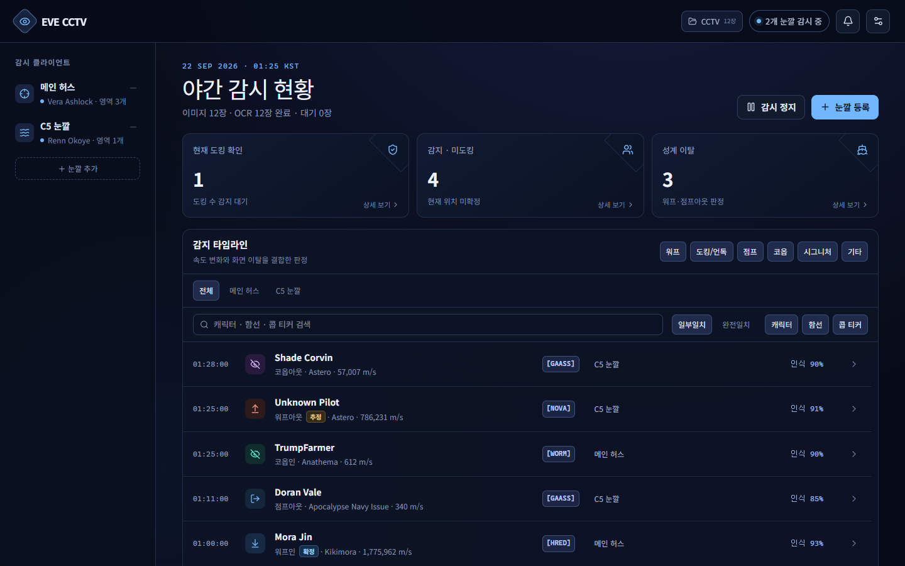
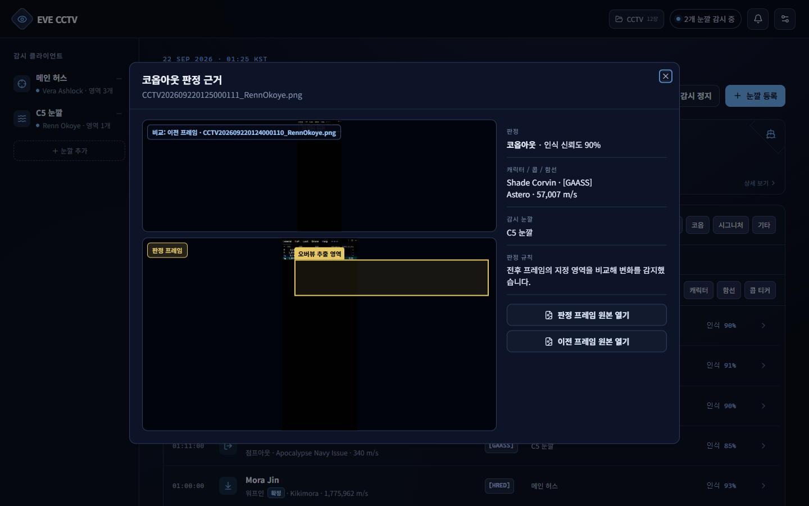
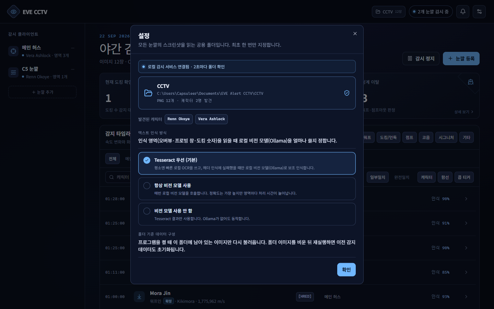
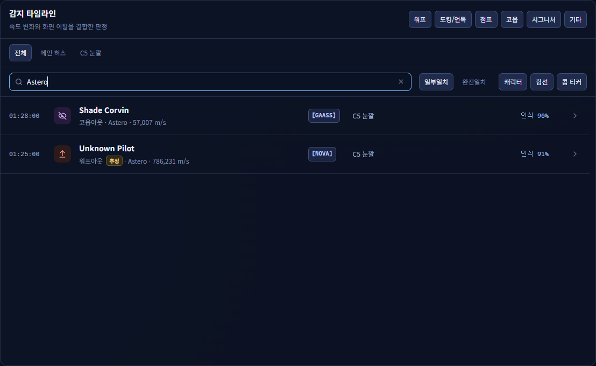

# EVE CCTV

> **이 프로젝트는 [Argus](https://github.com/LanturnHouse/Argus)에 병합되었습니다.**
>
> EVE CCTV의 기능은 Argus의 `Argus.Modules.Cctv` 모듈로 C#에서 새로 구현되었고, 이후 개발은 Argus에서 진행합니다. 이 저장소는 기존 웹 애플리케이션 버전의 기록으로 남겨 둡니다.
>
> - Argus의 CCTV 모듈은 Tesseract OCR 없이 Ollama 비전 모델만 사용해 스크린샷을 읽습니다.
> - 이 저장소의 판정 알고리즘 설명(10장)은 Argus의 판정 로직을 이해하는 참고 자료로 그대로 유효합니다.

## 1. 프로젝트 소개

EVE CCTV는 EVE Online 클라이언트가 저장한 CCTV 스크린샷을 주기적으로 읽어 오버뷰, 프로브 스캐너, 스트럭쳐 도킹 숫자의 변화를 기록하는 Windows용 로컬 웹 애플리케이션입니다.

스크린샷 원본, 잘라낸 인식 영역, 설정, 분석 결과는 사용자 PC의 `.local-data` 폴더와 SQLite 데이터베이스에 저장됩니다. 기본 OCR은 Tesseract로 실행되며, 선택한 경우 Ollama의 로컬 비전 모델로 인식을 보완합니다.

### 주요 용도

- 웜홀 또는 게이트 주변의 함선 진입과 이탈 감시
- 스트럭쳐 주변의 워프인, 워프아웃, 도킹, 언독 감시
- 코버트 옵스 클로킹이 가능한 함선의 코옵인, 코옵아웃 기록
- 프로브 스캐너의 시그니처 생성과 소멸 기록
- 감지 이벤트의 전후 프레임과 판정 근거 확인
- 감시 클라이언트, 이벤트 종류, 캐릭터, 함선, 콥 티커별 검색

## 2. 화면 미리보기

> 아래 화면은 실제 감시 데이터가 아닌, 기능을 보여주기 위해 만든 예시 데이터입니다.

**대시보드**: 감시 클라이언트, 실시간 현황, 감지 타임라인과 검색



**판정 근거**: 이벤트를 누르면 이전 프레임과 판정에 사용한 프레임을 비교할 수 있습니다.



**설정**: 공용 CCTV 폴더와 텍스트 인식 방식(Tesseract / Ollama)을 고릅니다.



**검색**: 감시 클라이언트와 감지 항목 필터 결과 안에서 캐릭터, 함선, 콥 티커로 찾습니다.



전체 화면(코퍼레이션별 전력 현황, 프로빙 변화 포함)은 [docs/screenshots/dashboard-full.png](docs/screenshots/dashboard-full.png)에서 볼 수 있습니다.

## 3. 동작 구조

1. 로컬 감시 서비스가 지정된 폴더를 2초마다 확인합니다.
2. CCTV 파일명에서 캐릭터와 촬영 시간을 읽습니다.
3. 캐릭터별로 설정한 오버뷰, 프로빙 창, 도킹 숫자 영역을 잘라냅니다.
4. Tesseract 또는 Ollama로 텍스트와 숫자를 인식합니다.
5. 이전 유효 프레임과 현재 프레임을 비교해 이벤트를 판정합니다.
6. 결과를 SQLite에 저장하고 웹 화면의 타임라인과 현황에 표시합니다.

웹 화면은 기본적으로 `http://localhost:5173`, 로컬 감시 API는 `http://127.0.0.1:8765`에서 실행됩니다.

## 4. 요구 사항

- Windows 10 또는 Windows 11
- Node.js 22.13 이상
- npm
- CCTV 스크린샷을 저장하는 폴더
- 선택 사항: Ollama와 비전 모델
- 선택 사항: Ollama 처리 속도를 높이기 위한 NVIDIA GPU

## 5. 설치

프로젝트 폴더에서 PowerShell을 열고 의존성을 설치합니다.

```powershell
npm ci
```

Ollama 보조 인식을 사용하려면 Ollama를 설치한 뒤 기본 모델을 받습니다.

```powershell
ollama pull qwen2.5vl:7b
```

다른 비전 모델을 쓰려면 `EVE_CCTV_VISION_MODEL` 환경 변수로 이름을 지정할 수 있습니다.

## 6. 실행과 종료

### 간편 실행

`eve-cctv-start.bat`을 더블클릭합니다. 실행 창을 닫으면 감시 서비스도 종료됩니다.

### PowerShell 실행

```powershell
npm run dev
```

웹 브라우저에서 다음 주소를 엽니다.

```text
http://localhost:5173
```

이미 `8765` 포트를 쓰는 프로세스가 있으면 `EADDRINUSE`가 표시됩니다. 기존 EVE CCTV 실행 창을 종료한 후 다시 실행하거나, 작업 관리자에서 남은 Node.js 프로세스를 종료합니다.

## 7. 최초 설정

### 7.1 CCTV 폴더 연결

1. 우측 상단의 **설정** 버튼을 누릅니다.
2. 폴더 카드 영역을 누릅니다.
3. EVE CCTV 스크린샷이 저장되는 폴더를 선택합니다.
4. 카드에 PNG 개수와 발견된 캐릭터 수가 표시되는지 확인합니다.

프로그램을 다시 켜면 현재 폴더에 남아 있는 이미지를 기준으로 데이터를 구성합니다. 폴더를 비운 뒤 재실행하면 이전 감지 데이터도 초기화될 수 있습니다.

### 7.2 텍스트 인식 방식 선택

- **Tesseract 우선 (기본)**: 빠른 OCR을 먼저 실행하고 헤더 인식에 실패한 영역만 Ollama로 재시도합니다.
- **항상 비전 모델 사용 (권장)**: 모든 인식 영역에 Ollama를 사용합니다. 처리 시간은 늘어나지만 안정적인 인식을 위해 이 설정을 권장합니다.
- **비전 모델 사용 안 함**: Tesseract만 사용합니다. Ollama 없이 실행할 수 있습니다.

> **권장 설정과 측정 성능**
>
> 인식 안정성을 우선한다면 **항상 비전 모델 사용**을 권장합니다. GeForce RTX 5070 Ti가 장착된 PC에서 EVE Online 클라이언트 2개를 실행하고, 각 클라이언트에서 `Ctrl` + `Shift` + `F9`로 그래픽 UI를 숨긴 상태로 측정했을 때 이미지 1장 인식에 약 **7초**가 소요되었습니다. 실제 처리 시간은 GPU, 비전 모델, 인식 영역 수와 크기, 동시에 실행하는 클라이언트 수에 따라 달라질 수 있습니다.

### 7.3 감시 클라이언트 등록

1. 좌측의 **+** 버튼을 눌러 감시 눈깔 등록 창을 엽니다.
2. 파일명에서 발견된 캐릭터를 선택합니다.
3. 사람이 구분하기 쉬운 감지 이름을 입력합니다.
4. 감시 타입을 선택합니다.
   - **스트럭쳐 감시**: 오버뷰와 도킹 숫자를 비교해 도킹과 언독을 판정합니다.
   - **웜홀 / 게이트 감시**: 오버뷰 진입과 이탈을 점프인과 점프아웃 판정에 사용합니다.
5. 다음 단계에서 인식 영역을 지정하고 저장합니다.

## 8. 인식 영역 지정

상단에서 영역 종류를 고른 뒤 이미지에서 드래그합니다.

### 오버뷰

함선 행의 캐릭터 이름, 콥 티커, 함선 이름, 거리 또는 속도가 모두 들어오도록 지정합니다. 헤더가 보이고 다른 UI가 최대한 섞이지 않게 선택하면 인식률이 좋아집니다.

### 프로빙 창

프로브 스캐너 목록의 **ID**와 **이름** 헤더부터 시그니처 행까지 포함합니다. 헤더를 찾지 못하면 영역 재설정 경고가 표시됩니다.

### 도킹 숫자

도킹 숫자와 대괄호가 보이는 작은 영역을 지정합니다. 화면에 `[0]`처럼 표시돼도 내부 분석에서는 가운데 숫자만 사용합니다.

### 영역 지정 팁

- EVE UI 배율, 창 크기, 오버뷰 열 너비를 먼저 고정합니다.
- 글자가 잘리지 않도록 약간의 여백을 둡니다.
- 서로 다른 종류의 영역이 겹치지 않게 합니다.
- EVE 창 위치나 UI 배율을 바꾸면 영역을 다시 지정합니다.
- **모두 지우기**를 누르면 해당 감시 클라이언트의 영역을 다시 그릴 수 있습니다.

## 9. 이벤트 판정 개요

### 워프인

첫 유효 관측 속도가 워프 기준 이상이고 다음 유효 프레임에서 감속이 확인되면 워프인으로 판정합니다.

### 점프인과 언독

워프인 속도 조건을 충족하지 않은 저속 신규 출현은 감시 타입에 따라 분류합니다.

- 웜홀 / 게이트: 점프인
- 스트럭쳐: 언독

스트럭쳐에서는 도킹 숫자 감소가 가까운 프레임에서 확인되면 언독 근거가 강화됩니다.

### 워프아웃

오버뷰에서 사라지기 전 마지막 유효 속도가 워프 기준 이상일 때 워프아웃으로 판정합니다. 이전 유효 프레임보다 속도가 증가했다면 확인 판정으로 표시하고, 마지막 속도만 높다면 추정 판정으로 표시합니다.

### 점프아웃과 도킹

워프아웃 조건을 충족하지 않은 상태에서 오버뷰에서 사라지면 감시 타입에 따라 분류합니다.

- 웜홀 / 게이트: 점프아웃
- 스트럭쳐: 도킹 후보

스트럭쳐에서는 도킹 숫자 증가가 가까운 프레임에서 일치하면 도킹으로 확정합니다.

텍스트와 배경이 흐릿한 전환 프레임은 속도 판정에서 제외합니다.

### 코옵인과 코옵아웃

코버트 옵스 클로킹이 가능한 함선은 워프와 점프 또는 도킹을 화면만으로 안정적으로 분리하기 어렵기 때문에 코옵인과 코옵아웃으로 묶어 표시합니다. 대상에는 Astero, Pacifier, Metamorphosis, Prospect와 프로젝트에 등록된 코버트 함선이 포함됩니다. 장착 서브시스템에 따라 코버트 여부가 달라지는 T3 크루저는 일반 판정 규칙을 사용합니다.

### 프로빙 변화

시그니처 ID 앞 3글자를 기준으로 현재 목록을 추적합니다. 생성은 초록색 **+**, 소멸은 빨간색 **−**로 표시합니다. 그룹을 알 수 없는 코즈믹 시그니처는 물음표 아이콘을 쓰고 그룹은 비워 둡니다.

## 10. 판정 알고리즘 상세

### 10.1 처리 단위와 프레임 순서

각 감시 클라이언트는 파일명에서 얻은 촬영 순서대로 독립적으로 처리됩니다. 현재 이미지의 인식 결과와 같은 감시 클라이언트에서 직전에 처리가 끝난 이미지의 결과를 비교합니다. 한 클라이언트의 상태나 카운트는 다른 클라이언트와 합산하지 않습니다.

### 10.2 오버뷰 행 정리

상태 머신에 넣기 전에 다음 정규화를 수행합니다.

1. 함선 이름 뒤에 붙은 OCR 기호와 숫자 찌꺼기를 첫 특수문자부터 제거합니다.
2. 웜홀, 스타게이트, 스트럭쳐, 태양 등 파일럿이 아닌 오버뷰 행을 제외합니다.
3. 속도를 읽지 못한 행도 캐릭터가 사라진 것으로 취급하지 않고 속도만 미확인 상태로 유지합니다.
4. 캐릭터 이름을 대문자와 단일 공백 형태로 정규화해 동일 대상을 찾습니다.
5. 이름이 약간 다르게 인식된 경우 함선 이름이 같고 이름 길이 차이와 편집 거리가 2 이하인 후보가 정확히 하나일 때 기존 대상과 연결합니다.

### 10.3 유효 프레임과 흐림 제거

EVE 화면에서는 함선이 사라지기 직전 행 전체가 흐려지고 어두워지면서 속도가 0처럼 읽힐 수 있습니다. 현재 행 밝기가 직전 유효 밝기의 50% 미만이면 전환 중인 흐린 프레임으로 판단합니다.

이 프레임은 대상이 아직 오버뷰에 존재하는 것으로 유지하지만 속도, 밝기, 마지막 유효 이미지 갱신에는 사용하지 않습니다. 따라서 흐린 0 속도 프레임이 워프아웃 판정을 덮어쓰지 않습니다.

오버뷰에서 대상을 제거하는 판정은 모든 오버뷰 영역에서 헤더 인식이 성공해 `overviewDetected=true`인 프레임에서만 실행합니다. 오버뷰 인식 실패나 빈 크롭 한 장으로 전체 함선이 이탈한 것으로 처리하지 않습니다.

### 10.4 워프 속도 기준

워프 판정 임계값은 **10,000 m/s**입니다.

```text
warpSpeed = speed >= 10,000 m/s
```

속도가 임계값 이상이면 워프 속도 후보로 사용합니다. 코버트 옵스 대상은 별도 규칙을 적용하므로 이 비교에서 제외합니다.

### 10.5 진입 판정

새 캐릭터 행이 오버뷰에 등장하면 다음 순서로 판정합니다.

1. 함선이 코버트 옵스 목록에 있으면 즉시 **코옵인**으로 기록합니다.
2. 함선과 속도를 읽었고 속도가 10,000 m/s 미만이면:
   - 웜홀 / 게이트 감시: **점프인**
   - 스트럭쳐 감시: 우선 **언독 추정**
3. 첫 속도가 10,000 m/s 이상이면 **워프인 추정**으로 기록하고 다음 유효 프레임을 기다립니다.
4. 다음 유효 속도가 이전 고속 값보다 낮아지면 감속이 확인된 것이므로 **워프인 확정**으로 갱신합니다.
5. 첫 속도를 읽지 못한 상태로 판단 근거가 끝나면 임의로 워프인을 만들지 않고 **오버뷰 인**으로 기록합니다.

고속 값이 여러 프레임 유지되면 바로 점프인이나 언독으로 바꾸지 않고, 실제로 낮은 속도가 관측될 때까지 워프인 후보를 유지합니다.

### 10.6 이탈 판정

신뢰 가능한 현재 오버뷰에서 기존 대상이 사라졌을 때 마지막 유효 속도와 그 이전 유효 속도를 사용합니다.

1. 코버트 옵스 함선이면 **코옵아웃**
2. 마지막 속도가 10,000 m/s 이상이고 이전 속도보다 증가했으면 **워프아웃 확정**
3. 마지막 속도가 10,000 m/s 이상이지만 증가 추세를 확인하지 못했으면 **워프아웃 추정**
4. 워프 속도가 아니고 웜홀 / 게이트 감시면 **점프아웃**
5. 워프 속도가 아니고 스트럭쳐 감시면 우선 **오버뷰 아웃** 후보로 두고 도킹 숫자 변화를 기다립니다.

현재 프레임에 대상 행이 남아 있거나 흐린 행으로 확인되면 이탈 판정을 실행하지 않습니다.

### 10.7 도킹과 언독 상관관계

스트럭쳐 감시에서는 오버뷰 변화와 도킹 카운터 변화를 최대 **2개 후속 프레임**, **10초** 안에서 연결합니다.

- 오버뷰에 추가된 후보 수와 도킹 숫자 감소량이 같으면 **언독 확정**
- 오버뷰에서 제거된 후보 수와 도킹 숫자 증가량이 같으면 **도킹 확정**
- 둘 이상의 도킹 영역이 동시에 변하면 어느 대상과 연결되는지 알 수 없으므로 확정하지 않습니다.
- 같은 시간 창에 진입과 이탈 후보가 함께 있으면 모호하므로 확정하지 않습니다.
- 코옵 대상이 같은 시간 창에 있으면 정확한 연결을 방해할 수 있어 도킹·언독 확정을 막습니다.
- 제한 시간 안에 도킹 숫자 근거가 없으면 언독 추정은 **오버뷰 인**으로 낮추고, 이탈은 **오버뷰 아웃**으로 유지합니다.
- `[0]` 같은 도킹 표시는 괄호를 제외하고 가운데 정수만 비교합니다.

### 10.8 코버트 옵스 판정

코버트 옵스 클로킹이 가능한 것으로 등록된 함선은 화면만으로 워프와 점프 또는 도킹을 안정적으로 구분할 수 없으므로 속도와 감시 타입에 관계없이 등장과 이탈을 각각 **코옵인**, **코옵아웃**으로 표시합니다.

현재 목록에는 Covert Ops 프리깃, Stealth Bomber, Force Recon, Blockade Runner, Black Ops와 Astero, Prospect, Pacifier, Metamorphosis가 포함됩니다. T3 크루저처럼 장착한 서브시스템에 따라 코버트 가능 여부가 달라지고 오버뷰에서 장착 상태를 확인할 수 없는 함선은 일반 판정 규칙을 사용합니다.

### 10.9 프로빙 시그니처 판정

프로빙 창에서 읽은 시그니처 ID를 현재 상태와 비교합니다.

- 처음 나타난 ID: **시그니처 생성**
- 계속 존재하는 ID: 이름, 그룹, 거리와 마지막 확인 시각 갱신
- 한 번 누락된 ID: OCR 누락일 수 있으므로 보류
- 두 번 연속 성공한 스캔에서 누락된 ID: **시그니처 소멸**

프로빙 창이 숨겨졌거나 빈 화면으로 인식된 경우 모든 시그니처가 사라졌다고 판단하지 않습니다. 유효한 시그니처 행이 하나 이상 읽힌 성공 스캔에서만 상태를 비교합니다.

### 10.10 확정과 추정

**확정**은 속도 변화나 도킹 숫자 변화처럼 전후 프레임의 추가 근거가 일치한 결과입니다. **추정**은 첫 고속 관측 또는 마지막 고속 관측처럼 한 프레임의 강한 근거만 있는 결과입니다.

각 이벤트에는 판정 사유, 이전 속도, 마지막 속도, 전후 이미지 ID와 도킹 숫자 변화가 가능한 범위에서 저장됩니다. 타임라인의 판정 근거 창에서 사용된 이미지와 규칙을 확인할 수 있습니다.

## 11. 화면 사용법

### 감시 클라이언트 필터

좌측 감시 클라이언트를 선택하면 그 클라이언트의 이미지 수, 대기 수, 타임라인, 프로빙 기록을 중심으로 표시합니다.

### 감지 타입 필터

타임라인 상단의 워프, 도킹/언독, 점프, 코옵, 시그니처, 기타 버튼으로 이벤트 종류를 복수 선택할 수 있습니다.

### 검색

검색은 현재 선택된 감시 클라이언트와 감지 타입 필터 결과 안에서 실행됩니다.

- **일부일치**: 입력 문자열이 필드 일부에 포함되면 표시합니다.
- **완전일치**: 공백과 대소문자를 정리한 전체 값이 같은 항목만 표시합니다.
- 검색 대상: 캐릭터 이름, 함선 이름, 콥 티커
- 검색 대상 버튼은 복수 선택할 수 있으며 최소 한 개는 유지됩니다.

### 판정 근거 확인

타임라인 이벤트를 누르면 다음 정보를 확인할 수 있습니다.

- 이벤트에 사용한 원본 이미지
- 오버뷰, 프로빙 또는 도킹 숫자 추출 영역
- 감시 눈깔
- 판정 규칙과 확인 또는 추정 상태
- 가능한 경우 이전 프레임과 현재 프레임 비교

### 감시 제거

좌측 감시 클라이언트의 제거 버튼을 누르면 해당 설정과 분석 기록이 초기화됩니다. CCTV 폴더의 원본 PNG는 삭제하지 않습니다.

## 12. 환경 변수

| 변수 | 기본값 | 설명 |
| --- | --- | --- |
| `EVE_CCTV_SERVICE_PORT` | `8765` | 로컬 감시 API 포트 |
| `EVE_CCTV_VISION_HOST` | `http://127.0.0.1:11434` | Ollama 주소 |
| `EVE_CCTV_VISION_MODEL` | `qwen2.5vl:7b` | Ollama 비전 모델 |
| `EVE_CCTV_VISION_MODE` | `fallback` | `off`, `fallback`, `always` |

예시:

```powershell
$env:EVE_CCTV_VISION_MODE = "off"
npm run dev
```

## 13. 데이터 위치와 개인정보

다음 로컬 데이터는 Git에 포함되지 않습니다.

- `.local-data/eve-cctv.sqlite`: 설정과 분석 결과
- `.local-data` 내부 원본 또는 크롭 이미지
- `.env*`: 환경 변수 파일
- `.npm-cache`, `.next`, `dist`: 캐시와 빌드 결과
- Tesseract 학습 데이터와 TypeScript 생성 파일

프로젝트는 외부 OCR API를 요구하지 않습니다. Ollama를 사용하는 경우에도 기본 구성에서는 로컬 Ollama 서버만 호출합니다.

## 14. 문제 해결

### 로컬 감시 서비스 오프라인

- `eve-cctv-start.bat` 또는 `npm run dev`가 실행 중인지 확인합니다.
- 콘솔에 표시된 오류를 확인합니다.
- 8765 포트 충돌이 있으면 기존 프로세스를 종료합니다.

### 헤더 또는 도킹 숫자를 읽지 못함

- 최신 스크린샷에서 영역을 다시 지정합니다.
- 프로빙 영역에 ID와 이름 헤더가 모두 포함됐는지 확인합니다.
- 도킹 숫자가 잘리지 않았는지 확인합니다.
- EVE UI 배율과 창 위치가 설정 당시와 같은지 확인합니다.
- Tesseract 우선에서 계속 실패하면 항상 비전 모델 사용으로 비교합니다.

### 인식이 처리 속도를 따라가지 못함

- 인식 방식을 Tesseract 우선 또는 비전 모델 사용 안 함으로 바꿉니다.
- 불필요하게 큰 인식 영역을 줄입니다.
- 항상 비전 모델 사용 시 영역마다 모델 호출이 발생하므로 대기열이 늘어날 수 있습니다.

### 이벤트가 반복되거나 잘못 분류됨

이벤트의 판정 근거 창에서 전후 이미지, 마지막 속도, 이전 속도, 추출 영역을 확인합니다. 흐릿한 전환 프레임, 잘린 속도 열, OCR 오인식이 원인인지 먼저 확인한 뒤 영역을 조정합니다.

## 15. 개발 및 검증

```powershell
npx tsc --noEmit -p tsconfig.json
npm run lint
npm run analysis:smoke
npm run build
```

특정 이미지 OCR 확인:

```powershell
npm run ocr:smoke -- "C:\path\to\screenshot.png"
```

주요 코드 위치:

- `app/page.tsx`: 대시보드와 설정 UI
- `local-service/server.mjs`: 폴더 감시와 로컬 API
- `local-service/analysis.mjs`: 이벤트 상태와 판정
- `local-service/ocr.mjs`: Tesseract 인식
- `local-service/vision.mjs`: Ollama 보조 인식
- `local-service/database.mjs`: SQLite 저장

## 16. 기획 및 구현 기여

### 프로젝트 소유자 · 기획자

**HaSeungJun (LanturnHouse)**

다음 영역을 직접 담당했습니다.

- 프로젝트의 최초 아이디어와 목적 수립
- 전체 사용 흐름과 작동 방식 설계
- 오버뷰, 프로빙 창, 도킹 숫자를 이용한 감시 방식 설계
- 워프인, 워프아웃, 점프인, 점프아웃, 도킹, 언독 판정 기준 정의
- 코버트 옵스 함선의 코옵인·코옵아웃 분류 방식 정의
- 감시 클라이언트별 현황과 타임라인 구성 기획
- 검색, 필터, 비교 이미지, 판정 근거 표시 등 UI 기능 기획
- 실제 EVE Online 스크린샷과 관측 결과를 이용한 동작 검증
- 오인식과 잘못된 이벤트 판정 사례 발견 및 수정 방향 결정
- OCR과 로컬 LLM 사용 방식, 처리 속도와 정확도 사이의 운영 기준 결정
- 최종 기능 범위, 사용자 경험과 제품 방향 결정

### 구현 방식

이 프로젝트는 프로젝트 소유자의 아이디어, 요구사항, 작동 방식 설계와 실제 관측 결과를 바탕으로 **바이브 코딩 방식**으로 구현되었습니다.

프로젝트 소유자가 원하는 동작, 판정 규칙, 화면 구성, 오류 사례와 수정 기준을 제시했고, AI 코딩 도구가 그 지시에 따라 코드를 작성하고 반복적으로 수정했습니다. 구현 결과를 프로젝트 소유자가 실제 데이터로 확인하고 다음 변경 방향을 결정하는 방식으로 개발했습니다.

### AI 코딩 도구가 담당한 부분

- 요구사항을 React 및 Node.js 코드로 구현
- 로컬 폴더 감시 서비스와 웹 대시보드 연결
- Tesseract OCR 및 Ollama 비전 모델 연동 코드 작성
- SQLite 저장 구조와 로컬 API 구현
- 이벤트 상태 관리와 판정 로직 코드 작성
- 영역 선택, 설정 창, 타임라인, 검색과 필터 UI 구현
- 사용자 제공 사례에 따른 버그 수정과 예외 처리
- TypeScript, ESLint, 스모크 테스트와 프로덕션 빌드를 이용한 기술 검증
- 프로젝트 및 사용 설명서 작성과 정리
- Git 저장소 구성과 GitHub 업로드 지원

기능의 목적, 판정 기준, 사용자 경험과 최종 동작에 관한 결정은 프로젝트 소유자가 담당했습니다. AI 코딩 도구는 이 결정을 실행 가능한 코드로 옮기고 기술적 문제를 분석하며 검증 결과를 제공하는 구현 도구로 사용되었습니다.
